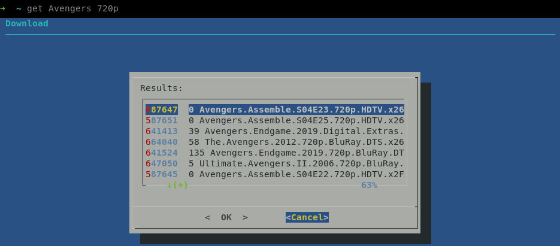
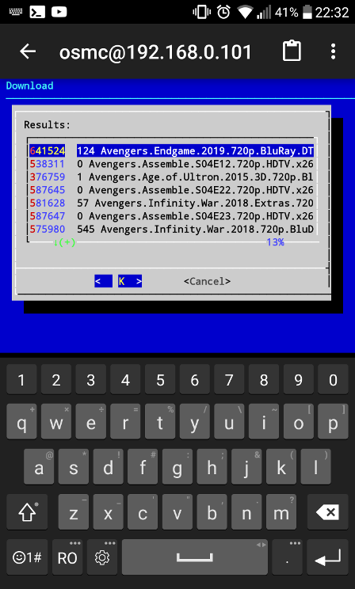

## Setup

* create the `user` `pass` and `tracker` files with the correct contents where the `install.sh` is located.
* call `install.sh`

## Usage

`get movie_name other_options_to_search_for`

## Example

`get Avengers 720p`

## Screenshot

## Menu explanation

* 1st column: Id
* 2nd column: Seeders
* 3rd column: Name